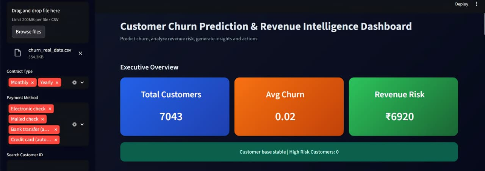
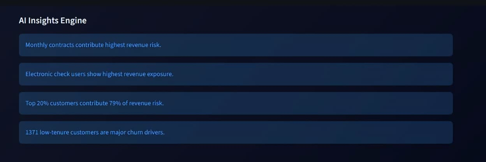
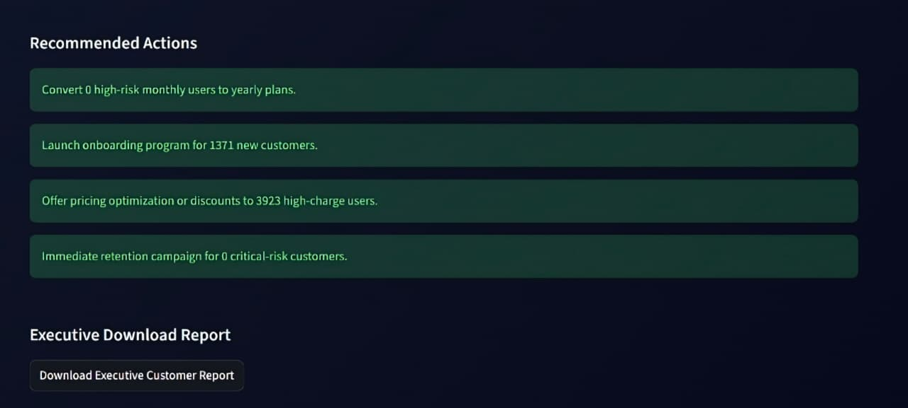
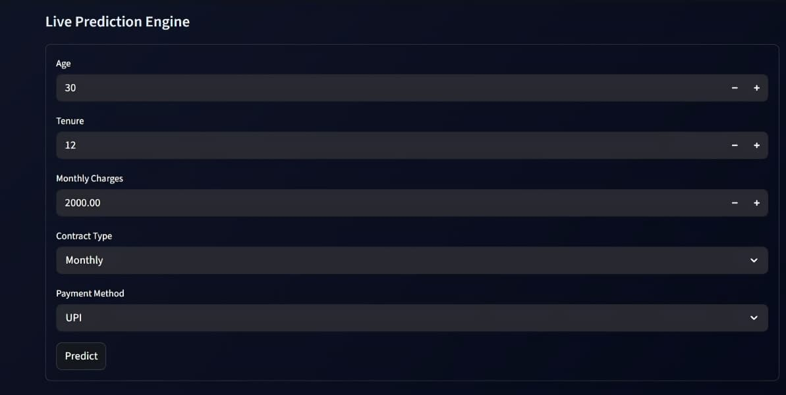

 Customer Churn Prediction & Revenue Intelligence Dashboard

An end-to-end Machine Learning + Analytics system to predict customer churn, quantify revenue risk, and generate actionable business insights.


 Executive Summary

This project simulates a real-world business intelligence system used by companies to:

- Identify customers likely to churn  
- Estimate revenue at risk  
- Generate AI-driven insights  
- Recommend strategic business actions  


 Dashboard Preview

 Executive Overview


 AI Insights Engine


 Recommended Actions


 Live Prediction Engine



 Key Features

-  KPI Dashboard (Customers, Churn Rate, Revenue Risk)
-  AI Insights Engine (Business intelligence summaries)
-  Recommended Actions (Strategic decisions)
-  Revenue Risk Analysis
-  Live Prediction Engine
-  Executive Report Download (CSV)


 Project Structure

Customer_Churn_Prediction_&_Revenue_Intelligence_Dashboard/
│
├── app/
│   └── streamlit_app.py        # Main dashboard UI (Streamlit)
│
├── assets/
│   ├── dashboard.png           # Dashboard screenshot
│   ├── ai_insights.png         # AI insights section image
│   ├── actions.png             # Recommended actions image
│   └── prediction.png          # Prediction engine image
│
├── data/
│   └── churn_data.csv          # Input dataset
│
├── model/
│   ├── churn_model.pkl         # Trained ML model
│   └── columns.pkl             # Model feature columns
│
├── notebooks/
│   └── (optional notebooks)    # Experimentation / EDA
│
├── src/
│   ├── data_preprocessing.py   # Data cleaning & preparation
│   ├── feature_engineering.py  # Feature creation
│   ├── train_model.py          # Model training
│   └── predict.py              # Prediction logic
│
├── main.py                     # Optional execution script
├── requirements.txt            # Dependencies
├── README.md                   # Project documentation
└── .gitignore                  # Ignored files (venv, cache, etc )


 Tech Stack

- Python
- Pandas
- NumPy
- Scikit-learn
- Plotly
- Streamlit
- Joblib


 How It Works

1. Data is loaded from CSV  
2. Preprocessing & feature engineering applied  
3. Model predicts churn probability  
4. Revenue risk is calculated  
5. Customers are categorized into risk segments  
6. AI Insights are generated  
7. Recommended actions are displayed  
8. Executive report is generated for download  


 Business Impact

- Helps reduce customer churn  
- Improves revenue retention  
- Enables data-driven decisions  
- Identifies high-risk customers early  


 Run the Project

```bash
pip install -r requirements.txt
streamlit run app/streamlit_app.py